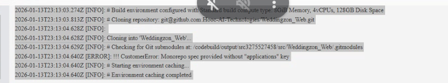

# AWS Amplify Deployment Guide (Web)

This guide walks you through deploying the **Weddingzon Web** application to AWS Amplify.

## Prerequisites

1.  **AWS Account**: Ensure you have an active AWS account.
2.  **GitHub Repository**: Ensure your code is pushed to GitHub (we already pushed to `dev`).

## Step 1: Connect to Amplify

1.  Log in to the **AWS Management Console**.
2.  Navigate to **AWS Amplify**.
3.  Click **"Create new app"** (or "New app" > "Host web app").
4.  Select **GitHub** as your existing code source and click **Next**.
5.  Authorize AWS Amplify to access your GitHub account if prompted.

## Step 2: Configure Repository and Branch

1.  **Select Repository**: Choose `Weddingzon_Web_Final` (or the name of your repo).
2.  **Select Branch**: Choose `dev` (since that is where we pushed the latest code).
3.  Click **Next**.

## Step 3: Configure Build Settings

Amplify will automatically detect the `amplify.yml` file we created in the root directory.

1.  **Build Name**: You can leave this as default.
2.  **Build Image**: Default Linux image is fine (Amplify supports Next.js automatically).
3.  **Build Specification**: You should see the custom config we added:
    ```yaml

    ```
    *If this is not automatically detected, click "Edit" and paste the above configuration.*

## Step 4: Environment Variables

**Crucial Step:** You must add your environment variables to Amplify for the app to function correctly.

1.  Click **Advanced settings**.
2.  Add Key-Value pairs for every variable in your local `.env.local` file.
    *   *Example:* `NEXT_PUBLIC_API_URL`, `NEXTAUTH_SECRET`, etc.
3.  You can open your local `.env.local` file to see which variables are needed.

## Step 5: Review and Deploy

1.  Click **Next**.
2.  Review all settings.
3.  Click **Save and deploy**.

## Step 6: Verify Deployment

1.  Amplify will start the provision, build, and deploy process.
2.  Watch the "Build" step. If it fails, check the logs.
    *   Common error: Check that `client/` directory exists and `package.json` is inside it (we verified this).
3.  Once the "Verify" stage is green, click the provided URL (e.g., `https://dev.xxxxxxxx.amplifyapp.com`) to view your live site.
